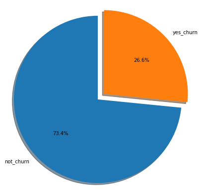
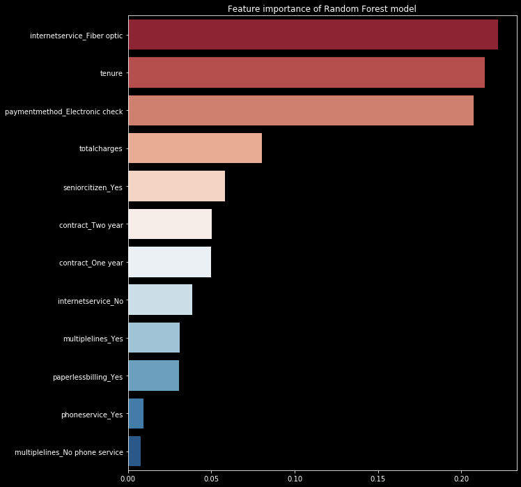

# Project 3 Telecom Churn Prediction

  # Introduction
  
  What Is Customer Churn?
Customer churn or customer attrition is the loss of customers by a business when customer stop using the service of the company. We calculate churn rate by dividing the number of customers were lost during that time period by the number of customers were existed at the beginning of that time period.

# Why it is important to calculate customer churn?
Because business is built on a number of customers using its service. Keeping its customers is less expensive than bringing new ones.

  # Important Questions:

Important Questions are:

Q1: What percentage of customers churn?

Q2: What are common variables among churn customers?

Q3: What is the predicted percentage of customer churn?

Q4: How to reduce customer churn?

To answer these questions, Telco retained a data scientist,who his/ her job will predict the customers who have high probability to churn , and help to set recommendations to keep them.

1.1.4  About Telco data
Each row represents a customer, each column contains customer’s attributes described on the column Metadata.

The raw data contains 7043 rows (customers) and 21 columns (features).

The “Churn” column is our target.

customerID: Customer ID, it is unique value and has 7043 inputs.

gender: Whether the customer is a male or a female.

SeniorCitizen: Whether the customer is a senior citizen or not (1, 0)

Partner:Whether the customer has a partner or not (Yes, No)

Dependents: Whether the customer has dependents or not (Yes, No)

tenure: Number of months the customer has stayed with the company

PhoneService:Whether the customer has a phone service or not (Yes, No)

MultipleLines:Whether the customer has multiple lines or not (Yes, No, No phone service)

InternetService:Customer’s internet service provider (DSL, Fiber optic, No)

OnlineSecurity:Whether the customer has online security or not (Yes, No, No internet service)

OnlineBackup:Whether the customer has online backup or not (Yes, No, No internet service)

DeviceProtection: Whether the customer has device protection or not (Yes, No, No internet service)

TechSupport: Whether the customer has tech support or not (Yes, No, No internet service)

StreamingTV: Whether the customer has streaming TV or not (Yes, No, No internet service)

StreamingMovies: Whether the customer has streaming movies or not (Yes, No, No internet service)

Contract:The contract term of the customer (Month-to-month, One year, Two year)

PaperlessBilling:Whether the customer has paperless billing or not (Yes, No)

PaymentMethod:The customer’s payment method (Electronic check, Mailed check, Bank transfer (automatic), Credit card (automatic))

MonthlyCharges: The amount charged to the customer monthly

TotalCharges:The total amount charged to the customer

Churn: Whether the customer churned or not (Yes or No)

 # EDA 
 I invistigated every caterogical column and I visualize it and I studied every numeric column and I visualize it.
 
 # Important categorical Features
In conclusion, based on our analyses, We can see the more servises are added the less people churn. Gender is not a feature, phone service and multipleline arn't important.

# List of important features are :
seniorcitizen,partner,dependents,internetservice,contract,paperlessbilling, and paymentmethod.
 
 

 # Methodlogy 
 
 
 
 # Modelling
 
Modelling with Logistic Regression,RandomForest,and XGBoost, I got the best accuracy of 85% with RandomForest. The Recall, Precison, and F1 were 85% in zero and one.

 
 # Metrics
 Evaluation Metrics
Important used metrics: which evaluation metric is most essential for this project 
churned customers are important. We need the model to predict as many churned customers as possible.
Thus, we cannot afford a high FN and must be low
Therefore, recall is important here and must be high
Also, When a model's F1 score is high, we know that the model is doing well all around.
 Metrics used was confuision matrix, testing accuracy score, AUC/Roc, Recall,Precesion, F1, and Cross validation
  
  
   

 
 # Conclusion
In conclusion, research in predicting customer churn has proved that it is very important field and it adds an income to Telecom companies.As we can see, some variables are negatively correlated with the predicted target (Churn), while some others behave positively. Negative correlation means that churn decreases when variable increases.

based on our EDA, We can see the more servises are added the less people churn. Gender is not a feature, phone service and multipleline arn't important.

List of important features are :
seniorcitizen,partner,dependents,internetservice,contract,paperlessbilling, paymentmethod,Totalcharges and Tenure.

By the end of this project I can set the following recommendations:

# Recommendation
Offer incentives for one/two year contract.

Seasonal Incentives for multiple lines on monthly charges when bringing dependents/partners.

Free services for non-churn such as streaming services

Stay competitive with internet services.

Special offers for senior citizens.

Be Proactive when changing business plan.

